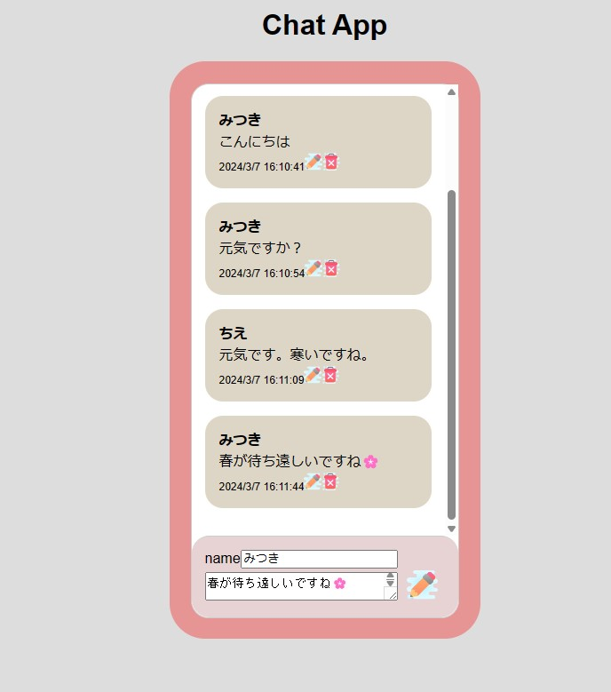

①課題番号-プロダクト名 
　チャットアプリ 
 
②課題内容（どんな作品か） 
　 LINE風チャットアプリ、投稿の修正削除ができます 
 
③DEMO 
　　https://chiecoep.github.io/kadai03_chat/ 
     
 
④工夫した点・こだわった点 
　  新しい投稿を下に表示させ、デフォルトを最下表示にしました 
    見た目をかわいく、見やすくしました 
 
⑤難しかった点・次回トライしたいこと(又は機能) 
　 　修正と削除を動画通りに作っても動かず沼りました※class名ミスでした 
　　改行させるのに挑戦しましたが完成できませんでした 
 
⑥質問・疑問・感想、シェアしたいこと等なんでも 
